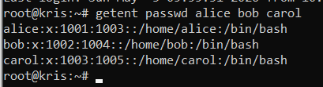
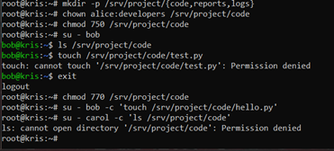
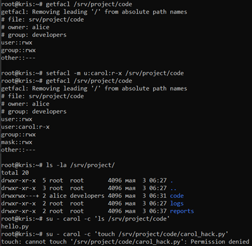
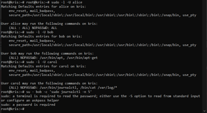

# ПР №3. Права доступа Linux и управление пользователями

## 1. Пользователи и группы

В рамках работы была смоделирована структура организации с тремя ролями:
| Пользователь | Группа | Роль |
|---|---|---|
| **alice** | developers | Администратор проекта |
| **bob** | developers | Разработчик |
| **carol** | auditors | Аудитор |

**Разбор полей /etc/passwd (на примере alice):**

`alice:x:1001:1004::/home/alice:/bin/bash`

1. **Логин**: alice — имя пользователя для входа.
2. **Пароль**: x — означает, что хэш пароля хранится в зашифрованном виде в `/etc/shadow`.
3. **UID**: 1001 — уникальный цифровой идентификатор пользователя.
4. **GID**: 1004 — идентификатор основной группы пользователя.
5. **GECOS**: (пусто) — дополнительная информация (ФИО и т.д.).
6. **Home**: `/home/alice` — путь к домашней директории.
7. **Shell**: `/bin/bash` — командная оболочка.

**Файл /etc/shadow:** содержит зашифрованные хэши паролей и параметры их срока действия. Он закрыт для обычных пользователей, чтобы исключить возможность кражи хэшей для последующего взлома перебором.



## 2. Права доступа chmod/chown

Итоговые права директории `/srv/project/code`: `chmod 770`, владелец `alice:developers`.

- **bob (в группе developers)**: **не мог** создать файл при правах `750`, так как цифра `5` (`r-x`) дает группе только чтение и выполнение (вход), но не запись. После перехода на `770` (`rwx`) запись стала доступна.
- **carol (не в группе)**: **не могла** даже войти в директорию, так как для "остальных" установлены права `0` (`---`), блокирующие любой доступ.

**Разбор прав файла q1.txt (640):**
- **Числовая запись (640)**: Владелец — 6 (чтение/запись), Группа — 4 (чтение), Остальные — 0 (нет прав).
- **Символьная запись (-rw-r-----)**: `rw-` для alice, `r--` для группы auditors, `---` для остальных.



## 3. ACL (Access Control Lists)

**Задача**: предоставить `carol` доступ на чтение кода, не меняя владельцев и группу файла.
**Команда**: `sudo setfacl -m u:carol:r-x /srv/project/code`.

**Вывод getfacl после изменения:**

```text `

# file: srv/project/code
# owner: alice
# group: developers
user::rwx
user:carol:r-x
group::rwx
mask::rwx
other::---

````

**Преимущество ACL**: стандартная модель ограничена одним владельцем и одной группой. ACL позволяет гибко назначать разные права любому количеству конкретных пользователей или групп для одного и того же файла.




## 4. sudo-политики


| Пользователь | Разрешено | Ограничение |
|---|---|---|
| **alice** | `ALL=(ALL:ALL) NOPASSWD:ALL` | Нет (полный доступ) |
| **bob** | `/usr/bin/apt`, `/usr/bin/apt-get` | Только управление пакетами |
| **carol** | `/usr/bin/journalctl`, `/bin/cat /var/log/*` | Только чтение логов |





**Принцип безопасности**: Использован **принцип минимальных привилегий** (Least Privilege) — доступ дается только к тем инструментам, которые нужны для выполнения конкретной роли.
**Разница NOPASSWD**: Использование `NOPASSWD` позволяет выполнять команды без ввода пароля пользователя, что удобно для администраторов или автоматизации, но требует осторожности.

## 5. PAM (Pluggable Authentication Modules)

*   **Модуль pam_unix.so в /etc/pam.d/sudo**: обеспечивает проверку подлинности пользователя через стандартные системные базы данных (passwd/shadow).
*   **Что означает required**: это обязательный флаг проверки. Если модуль вернул ошибку, авторизация в итоге будет отклонена, даже если другие модули прошли успешно.
*   **Минимальная длина пароля 12 символов**: необходимо добавить параметр `minlen=12` в строку модуля `pam_pwquality.so` внутри файла `/etc/pam.d/common-password`.

## Выводы
В ходе работы освоены методы управления пользователями и группами в Linux. Протестированы механизмы разграничения доступа: классические права (chmod/chown), расширенные списки (ACL) и точечные политики sudoers. Настроена безопасная среда для совместной работы администратора, разработчика и аудитора.

---

## Контрольные вопросы

1. **Что означает запись chmod 640 и кто при этом может читать файл?**
   Владелец (6 — rw), Группа (4 — r), Остальные (0 — нет доступа). Читать могут владелец и пользователи из группы-владельца.
2. **Чем setuid отличается от sudo?**
   `setuid` запускает программу всегда от имени её владельца (например, root), а `sudo` позволяет гибко настроить, кому и какие именно команды разрешено запускать от чужого имени.
3. **Почему хэши паролей хранятся в /etc/shadow, а не в /etc/passwd?**
   `/etc/passwd` должен быть доступен всем для работы системы, а `/etc/shadow` доступен только root. Это защищает зашифрованные пароли от кражи для подбора.
4. **Что произойдёт, если дать пользователю bob запись sudo bash?**
   Боб сможет запустить командную оболочку с правами root и получить полный, ничем не ограниченный контроль над системой.
5. **Разница между su и sudo.**
   `su` переключает пользователя полностью (требует пароль цели), а `sudo` выполняет конкретную команду (обычно требует пароль самого пользователя).
6. **Как запретить пользователю sudo, не удаляя из группы?**
   Можно добавить запрещающую запись в `/etc/sudoers` в самый конец: `username ALL=(ALL:ALL) !ALL`.
