# ПР №4. Аудит событий: journalctl и auditd

## 1. journalctl — системный журнал

###Создание аудита

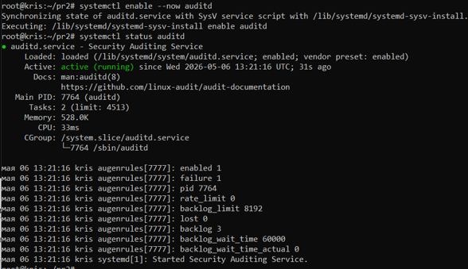

### Что зафиксировал журнал о команде sudo cat /etc/shadow

```
мая 06 13:41:54 kris sudo[8321]: root : TTY=pts/1 ; PWD=/root ; USER=root ; COMMAND=/usr/bin/cat /etc/shadow
```
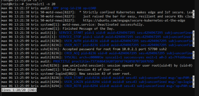
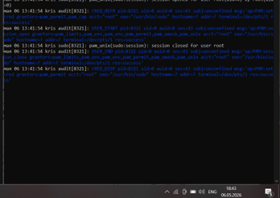

**Разбор полей:**
- `root` — имя пользователя, инициировавшего команду через sudo.
- `TTY=pts/1` — идентификатор терминала, с которого была выполнена команда.
- `PWD=/root` — текущий рабочий каталог пользователя.
- `USER=root` — целевой пользователь, с правами которого выполнена команда.
- `COMMAND=/usr/bin/cat /etc/shadow` — полный путь и аргументы запущенной команды.

### Ошибки в системе с последней загрузки

в системе зафиксированы следующие ошибки:

- Ошибки ядра (`kernel`): проблемы с контроллером SMBus (`piix4_smbus`) и сбои USB-хаба.
- Ошибки сервисов: сбои запуска службы `fwupd` (обновление метаданных прошивок).
- Ошибки безопасности: отказы аутентификации пользователя `bob` и попытки выполнения команд, запрещённых политикой `sudo`.

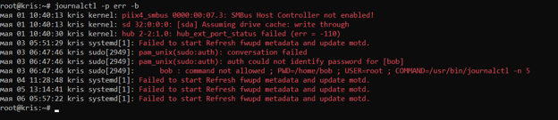

### Статистика входов

- Успешных входов: 7 (сессии для `root`, `kris`, `sshd`, системные процессы).
- Неудачных попыток:  1 (ошибка аутентификации пользователя `bob`).

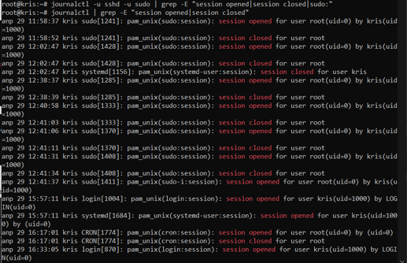

## 2. auditd — настройка правил

### Применённые правила (вывод auditctl -l)
```
-w /etc/passwd -p rwa -k auth-files
-w /etc/shadow -p rwa -k auth-files
-w /etc/group -p rwa -k auth-files
-w /etc/sudoers -p rwa -k priv-files
-w /etc/sudoers.d -p rwa -k priv-files
-w /etc/ssh/sshd_config -p rwa -k ssh-config
-a always,exit -F arch=b64 -S open,openat -F success=0 -k access-denied
-a always,exit -F arch=b64 -S unlink,unlinkat -k file-delete
-a always,exit -F arch=b64 -S execve -F euid=0 -F auid!=0 -F auid!=-1 -k priv-exec
```
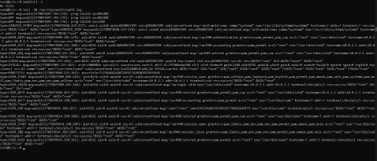

### Разбор записи SYSCALL

| Поле | Значение | Что означает |
|------|---------|-------------|
| auid | 0(root) | Audit ID — идентификатор пользователя при входе (не меняется при смене прав). |
| uid  | 0(root) | Текущий User ID пользователя, запустившего процесс. |
| euid | 0(root) | Effective User ID — фактические права доступа процесса. |
| comm | cat | Короткое имя исполняемого файла команды. |
| exe  | "/usr/bin/cat" |Полный путь к исполняемому файлу программы. |

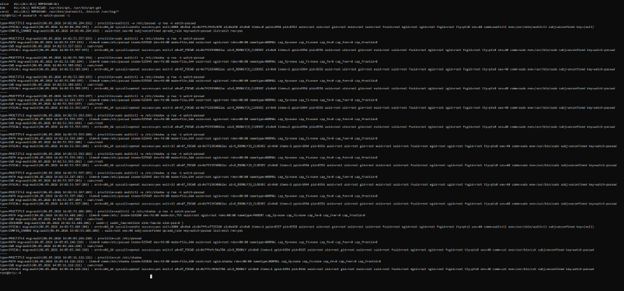
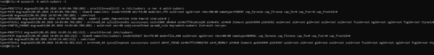

## 3. Расследование инцидента


### Хронология действий bob

| Время | Действие | Результат | Источник (команда поиска) |
|-------|---------|-----------|--------------------------|
| 06.05 13:41:54 | cat /etc/shadow | Отказ | ausearch -k access-denied |
| 06.05 14:23:52 | Поиск в логах аудита. | Отказ | ausearch -k auth-files -i |
| 06.05 14:27:22 | grep "malware" | Отказ | ausearch --start recent -i |


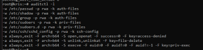
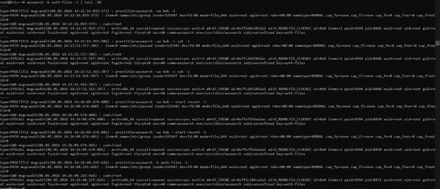
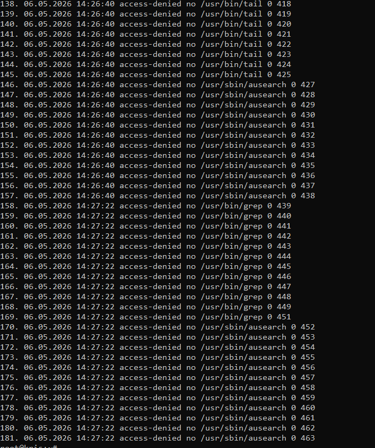
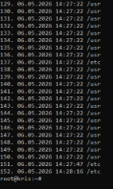


### Как auditd помог расследованию

- Позволил выявить конкретные системные вызовы (`openat`), которые привели к отказам доступа.
- Использование ключей (`-k`) упростило фильтрацию событий, связанных с попытками НСД.
- Фиксация `auid` позволила идентифицировать реального пользователя `bob`, даже если бы он использовал `sudo` от другого лица.

### Чем auditd лучше journalctl для задач аудита безопасности

1. **Идентификация (auid)** — отслеживает реального пользователя при входе, даже после `sudo`.
2. **Глубина мониторинга** — фиксирует системные вызовы на уровне ядра (чтение, запись, удаление, exec).
3. **Доказательная база** — журналы защищены от подделки приложением (приложение не может скрыть свой вызов).

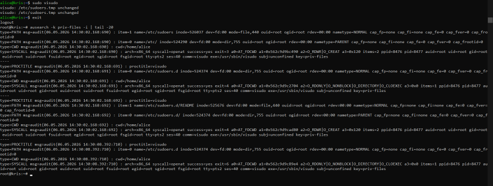

## 4. Связь с нормативкой

| Мера АУД | Как реализована в работе |
|----------|-------------------------|
| АУД.4 Аудит безопасности | Мониторинг доступа к файлам учётных записей (`/etc/passwd`, `/etc/shadow`) и конфигурациям служб (`/etc/sudoers`, `/etc/ssh/sshd_config`) |
| АУД.7 Мониторинг НСД | Через фильтрацию неудачных системных вызовов с ключом `access-denied` и анализ действий пользователя `bob` |


## Выводы

В ходе работы изучены механизмы логирования `journalctl` и подсистема аудита `auditd`.  
Настроены постоянные правила для отслеживания изменений в критических файлах и выявления несанкционированных попыток доступа.  
Проведён анализ смоделированного инцидента, подтвердивший эффективность `auditd` для задач безопасности.  
`journalctl` удобен для оперативного мониторинга сервисов, но `auditd` незаменим для глубокого аудита на уровне ядра и формирования доказательной базы.

## Контрольные вопросы

1. **Чем принципиально отличается auditd от journald? Почему нельзя обойтись только journald?**  
   `journald` собирает сообщения от приложений и системы, а `auditd` работает на уровне ядра, фиксируя системные вызовы.  
   `auditd` необходим, так как приложение может не логировать свои действия, но скрыть системный вызов (например, открытие файла) оно не может.

2. **Что такое auid и почему оно важнее uid при расследовании инцидентов с sudo?**  
   `auid` (Audit ID) сохраняет идентификатор пользователя, который вошёл в систему.  
   При использовании `sudo` `uid` меняется на `0` (root), а `auid` остаётся прежним, поэтому позволяет найти реального виновника.

3. **Что означает флаг -k в правиле auditd? Для чего он используется?**  
   Это текстовая метка (ключ) для правила.  
   Позволяет быстро фильтровать логи с помощью `ausearch -k <ключ>`.
4. **Чем -w (watch) отличается от -a always,exit в правилах auditd? Когда использовать каждый?**  
   - `-w` — для мониторинга файлов или директорий (простота, отслеживание доступа).  
   - `-a always,exit` — для сложных правил на системные вызовы с фильтрацией по аргументам, коду возврата, архитектуре.

5. **Злоумышленник удалил файл /var/log/audit/audit.log. Как это помогает ему скрыть следы и как от этого защититься?**  
   Удаление логов уничтожает доказательства действий.  
   Защита:  
   - настройка удалённого логирования (syslog/rsyslog);  
   - установка атрибута `+a` (append only) на файл лога (`chattr +a /var/log/audit/audit.log`);  
   - использование отдельного журналирующего хоста.

6. **Что нужно сделать чтобы правила auditd сохранились после перезагрузки?**  
   Правила нужно прописать в файлах внутри `/etc/audit/rules.d/` (например, `security-course.rules`) и выполнить `sudo augenrules --load`.


