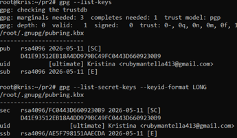
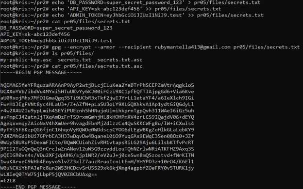
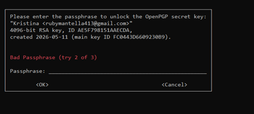
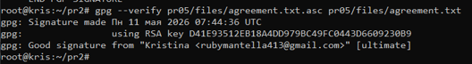
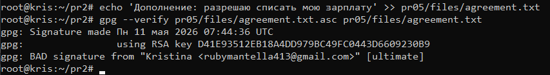
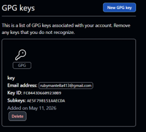
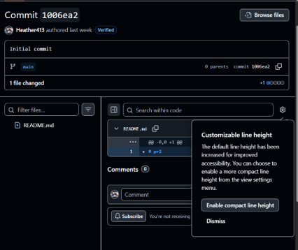
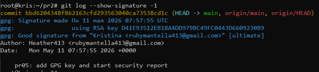

<!--
SPDX-FileCopyrightText: 2026 Kristina Efimova <rubymantella413@email.com>

SPDX-License-Identifier: MIT
-->

# ПР №5. Шифрование GPG, подпись коммитов и безвозвратное удаление
## 1. GPG-ключевая пара

- Key-ID: FC0443D6609230B9
- Тип: RSA 4096 бит
- Email: rubymantella413@gmail.com
- Размер публичного ключа: ... строк

Что означает флаг --armor: Этот флаг преобразует бинарный формат ключа (который компьютер не может отобразить как текст) в текстовый формат ASCII. Это позволяет копировать ключ, пересылать его в сообщениях и вставлять в веб-интерфейс настроек GitHub.

## 2. Шифрование

Зашифрованный файл (первые 5 строк):
```
-----BEGIN PGP MESSAGE-----

hQIMA65feYFRquzaAQ//XTn70vs0+cW5BCC3NeoWkZrD+O9pVZfFd8oW9FxwlRMP
Ux74ngPxmuNSWrsP787E0Jv1uDQvXLJgxNo2jKzRIHwPWrQeuEz9P3T3oj/pXiRh
CN9Qd0JnDCcS0idZOIfvPikARRvDWsnKp1g6B28vadGLL5vN+Ytq45BDjvP8QSj7

```


Можно ли прочитать исходные данные из зашифрованного файла: Нет, без приватного ключа содержимое файла выглядит как случайный набор символов (криптографический шум).



Что произойдёт если ввести неверный пароль при расшифровке: GPG выдаст ошибку Bad passphrase или decryption failed. Доступ к данным будет заблокирован, так как приватный ключ не будет расшифрован и не сможет «открыть» файл.



## 3. Цифровая подпись

Вывод gpg --verify (Good signature):



Вывод gpg --verify после изменения файла (BAD signature):



Почему подпись перестала быть действительной после изменения файла: Подпись создается на основе уникального хэша (цифрового отпечатка) файла. Изменение даже одного символа полностью меняет хэш, и математическая проверка показывает несовпадение подписи и содержимого.
Что именно проверяет gpg --verify: целостность и подлинность

## 4. Подпись коммитов





**Ссылка на коммит:** [запрещенный файл](https://github.com/Heather413/pr2/commit/bbd6204348f862163cfd293563040ca73538cd1c)

Вывод git log --show-signature -1:



Зачем проверять подпись локально если GitHub уже показывает Verified: это дополнительный уровень безопасности. Она позволяет убедиться, что код не был подменен по пути от сервера к вам или на самой локальной машине, когда интернет-соединение или браузер не задействованы.

## 5. rm vs shred

| Операция | Что происходит с данными на диске | Можно восстановить? |
|----------|----------------------------------|---------------------|
| rm       | Удаляется только запись в метаданных (inode) | Да, пока блоки не перезаписаны |
| shred    | Содержимое блоков перезаписывается случайными данными 3 раза, потом нулями | Нет |

Сценарий когда нужно затирать свободное место: При подготовке носителя (флешки или диска) к продаже или передаче другому человеку, чтобы гарантировать, что старые удаленные документы, пароли или личные фото не будут восстановлены.

## Вывод

В ходе практической работы я изучила принципы работы асимметричного шифрования GPG и цифровых подписей. Я научилась настраивать подтвержденный статус (Verified) для своих работ в Git, защищать конфиденциальные файлы и использовать методы гарантированного уничтожения информации, исключающие возможность их восстановления.

## Контрольные вопросы

**1. В чём разница между шифрованием и подписью? Можно ли одновременно зашифровать и подписать файл?**
* **Шифрование** обеспечивает конфиденциальность: оно делает данные нечитаемыми для всех, кроме обладателя ключа.
* **Подпись** обеспечивает подлинность и целостность: она доказывает, что файл отправил именно определенный пользователь и что содержимое не было изменено.
* Да, файл можно шифровать и подписывать одновременно (команда `gpg -s -e`). В этом случае получатель будет уверен и в секретности данных, и в том, кто их прислал.

**2. Почему публичный ключ можно раздавать всем, а приватный нельзя никому?**
* **Публичный ключ** — это «замок». Его можно раздавать всем, чтобы любой желающий мог «запереть» (зашифровать) для вас сообщение или проверить вашу подпись.
* **Приватный ключ** — это единственный ключ от этого «замка». Если он попадет к посторонним, они смогут читать вашу переписку и ставить подписи от вашего имени.

**3. Что произойдёт с зашифрованными данными, если потерять приватный ключ?**
* Данные станут **навсегда недоступными**. Математически расшифровать их без ключа невозможно, так как современные алгоритмы (например, RSA 4096) устойчивы к взлому.

**4. Можно ли подделать Verified коммит на GitHub, не имея приватного GPG-ключа владельца?**
* **Нет.** GitHub выдает бейдж **Verified** только в том случае, если цифровая подпись коммита математически совпадает с публичным ключом, загруженным в профиль пользователя. Без приватного ключа создать валидную подпись невозможно.

**5. Почему shred плохо работает на SSD? Что использовать вместо него?**
* **Причина:** Из-за алгоритмов «выравнивания износа» (wear leveling) контроллер SSD записывает новые данные (мусор от `shred`) в новые ячейки памяти, часто оставляя старые данные нетронутыми в других физических блоках.
* **Что использовать:** Для SSD лучше использовать встроенные аппаратные команды **ATA Secure Erase** или полное шифрование диска (например, LUKS или BitLocker).

**6. Коллега говорит: «Я отформатировал диск перед продажей — всё безопасно». Он прав?**
* **Нет, он не прав.** Быстрое форматирование (как и команда `rm`) просто очищает таблицу метаданных (оглавление). Сами данные остаются в блоках диска и могут быть восстановлены программами для криминалистического анализа.

**7. Чем отличается detach-sign (--detach-sign) от встроенной подписи (--sign)?**
* **--sign:** Создает новый бинарный файл, внутри которого находятся и сами данные, и подпись. Чтобы прочитать содержимое, файл нужно «обработать» через GPG.
* **--detach-sign:** Создает отдельный маленький файл подписи (например, с расширением `.sig` или `.asc`). Оригинальный документ остается нетронутым и читаемым обычными средствами, а подпись хранится рядом.
