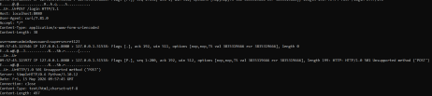

# ПР №6. Анализ сетевого трафика: tcpdump и Wireshark

## 1. Разбор строки tcpdump

Строка:
`09:38:52.425268 IP 127.0.0.1.60814 > 127.0.0.1.8080: Flags [S], seq 4017263926, win 65495, options [mss 65495,sackOK,TS val 3834186968 ecr 0,nop,wscale 7], length 0`

| Поле | Значение | Что означает |
| :--- | :--- | :--- |
| **09:38:52.425268** | Точное время | Время фиксации пакета сниффером (Часы:Минуты:Секунды.Микросекунды). |
| **IP** | Сетевой протокол | Указывает, что пакет относится к семейству протоколов IPv4. |
| **127.0.0.1.60814** | Источник (Source) | IP-адрес отправителя (`127.0.0.1` — локальный хост) и его исходный TCP-порт (`60814`), с которого клиент инициировал соединение. |
| **> 127.0.0.1.8080** | Назначение (Destination) | Направление движения пакета к целевому IP-адресу сервера (`127.0.0.1`) и целевому TCP-порту (`8080`), на котором слушает веб-приложение. |
| **Flags [S]** | Флаг SYN | TCP-флаг «Synchronize». Означает отправку запроса на установку нового сетевого соединения (первый шаг трехэтапного рукопожатия TCP Handshake). |
| **seq 4017263926** | Порядковый номер | Начальный порядковый номер (ISN) первого байта данных в этом TCP-соединении, используемый для контроля доставки пакетов. |
| **win 65495** | Размер окна (Window Size) | Количество байт (65495), которое отправитель готов принять на своей стороне без получения подтверждения ответа. |
| **options [...]** | Опции TCP | Дополнительные параметры соединения: `mss` (максимальный размер сегмента), `sackOK` (разрешение выборочного подтверждения пакетов), `TS val` (временная метка отправителя), `wscale` (коэффициент масштабирования окна). |
| **length 0** | Длина полезной нагрузки | Размер данных прикладного уровня, переносимых в пакете (0 байт, так как пакет является исключительно служебным для установки связи). |


## 2. Перехваченные данные HTTP



* **Что видно в трафике:** В перехваченном POST-запросе прикладного уровня полностью и открытым текстом видны все переданные конфиденциальные данные: заголовок авторизации `Authorization: Basic`, а также тело самого запроса, содержащее учетные данные пользователя: `username=vasya&password=MyPassword2024`.
* **Кто в реальной сети может так же прочитать этот трафик:** Любое лицо или устройство, находящееся на пути следования пакета от клиента к серверу: системные администраторы и провайдеры связи (ISP), владельцы публичных незащищенных Wi-Fi точек, а также злоумышленники, осуществляющие атаки класса MitM (Man-in-the-Middle) или ARP-spoofing в локальном сегменте сети.

## 3. Follow TCP Stream


* **Что видит злоумышленник перехвативший этот трафик:** Злоумышленник видит полную и последовательную текстовую картину обмена данными между клиентом и сервером. Ему доступен оригинальный HTTP-запрос (метод POST, запрашиваемый URL, заголовки `Host`, `User-Agent` и отправленные учетные данные) и последующий HTTP-ответ сервера (включая технические заголовки сервера и возвращаемый HTML-код `<!DOCTYPE HTML...>` ответа).

## 4. HTTP vs HTTPS — сравнение

| Что наблюдаем | HTTP | HTTPS |
| :--- | :--- | :--- |
| **IP-адреса** | Видны | **Видны** (сетевой уровень IP не шифруется, он необходим для маршрутизации пакетов). |
| **Заголовки** | Видны | **Не видны** (полностью инкапсулированы внутри зашифрованного слоя TLS). |
| **Тело запроса** | Видно | **Не видно** (передается в виде высокоэнтропийного бинарного шифротекста). |
| **Логин/пароль** | Видны | **Не видны** (криптографически защищены сквозным шифрованием). |
| **Имя домена** | Видно в Host | **Видно только в стартовом пакете приветствия Client Hello (поле SNI)**. |

## 5. DNS и приватность

* **Какие домены видны в DNS даже при HTTPS:** В процессе мониторинга трафика на порту 53 в открытом виде фиксируются абсолютно все запрашиваемые доменные имена (например, `github.com`, `example.com`, `google.com`).
* **Что это означает для приватности:** Это означает, что базовый протокол DNS работает без шифрования. Даже если содержимое ваших диалогов и пароли на сайтах защищены с помощью HTTPS, внешние наблюдатели (провайдеры, операторы связи) всё равно видят полную историю и хронологию посещения вами конкретных веб-ресурсов, что позволяет составить цифровой профиль пользователя.

## 6. Base64

* **Декодированная строка:** `dmFzeWE6TXlQYXNzd29yZDIwMjQ=` → `vazea:MyPassword2024`
* **Why Base64 не является шифрованием:** Алгоритм Base64 — это общедоступный стандарт кодирования, предназначенный исключительно для представления бинарных данных в виде строки из безопасных ASCII-символов для передачи по текстовым протоколам. В Base64 полностью отсутствует понятие секретного ключа (пароля шифрования), поэтому любой перехваченный текст может быть мгновенно возвращен в исходный вид стандартными средствами любой операционной системы за одну команду.

## 7. tshark vs tcpdump

| Инструмент | Когда использовать |
| :--- | :--- |
| **tcpdump** | Оптимален для быстрой и легковесной работы в CLI на серверах. Используется для низкоуровневого перехвата сырого трафика (захват в pcap-файлы) и фильтрации пакетов «на лету» без значительной нагрузки на CPU. |
| **tshark** | Применяется, когда необходим продвинутый консольный анализ и парсинг прикладных протоколов. Идеален для автоматизации, скриптов и вывода глубокой агрегированной статистики (например, иерархии протоколов через ключ `-z io,phs`). |
| **Wireshark** | Используется на локальных рабочих станциях ИБ-аналитиков, когда для расследования инцидента необходим мощный графический интерфейс (GUI), визуальный поиск по цветам, детальный ручной разбор структуры каждого пакета и удобная сборка сессий через Follow Stream. |

## 8. Каналы утечки через сеть

* **Какие меры защиты закрывают сетевой канал утечки:** 1. Повсеместный принудительный переход с HTTP на защищенный протокол **HTTPS (TLS версии 1.3)** для исключения перехвата данных в открытом виде.
  2. Использование механизмов **HSTS** (HTTP Strict Transport Security), запрещающих браузерам подключаться по небезопасному HTTP.
  3. Внедрение шифрованных протоколов разрешения имен — **DoH (DNS over HTTPS)** или **DoT (DNS over TLS)** для сокрытия имен посещаемых доменов от провайдера.
  4. Применение надежных корпоративных **VPN-туннелей** для инкапсуляции и шифрования абсолютно всего сетевого трафика рабочей станции на транспортном уровне.

---

## Контрольные вопросы

### 1. Что такое promiscuous mode и зачем он нужен снифферу?
* **Promiscuous mode (неразборчивый режим)** — это особый режим работы сетевого адаптера (NIC). В обычном режиме сетевая карта анализирует кадры на канальном уровне и пропускает внутрь операционной системы только те пакеты, которые адресованы лично ей (на основе совпадения её MAC-адреса), а также широковещательный (broadcast) трафик. 
* **Зачем нужен снифферу:** При включении неразборчивого режима сетевая карта отключает эту внутреннюю фильтрацию и начинает передавать снифферу (`tcpdump`, `Wireshark`) абсолютно все пакеты, которые физически проходят по кабелю или радиоэфиру через данный сетевой сегмент, независимо от их конечного адресата. Без этого пассивный перехват стороннего трафика невозможен.

### 2. Чем отличается capture filter от display filter в Wireshark?
* **Capture filter (фильтр захвата):** Задаётся строго **до** начала записи трафика (использует низкоуровневый синтаксис BPF — Berkeley Packet Filter). Он жестко определяет, какие пакеты сетевая карта будет перехватывать и сохранять в файл дампа, а какие — безвозвратно отбрасывать на лету. Помогает экономить дисковое пространство и RAM при работе в высоконагруженных сетях.
* **Display filter (фильтр отображения):** Применяется **после** или непосредственно во время захвата к уже сохранённому в памяти дампу. Он обладает гибким продвинутым синтаксисом, ничего не удаляет из файла и просто временно скрывает ненужные пакеты на экране, помогая аналитику сфокусироваться на конкретных узлах или протоколах.

### 3. Что такое Follow TCP Stream и для чего используется?
* **Follow TCP Stream** — это встроенная функция сетевого анализатора, которая автоматически собирает разрозненные, фрагментированные сетевые IP-пакеты (которые в реальном канале идут вперемешку с тысячами чужих пакетов) обратно в единый, последовательный и непрерывный поток данных прикладного уровня в том виде, в каком его обрабатывали клиент и сервер.
* **Для чего используется:** Применяется для быстрого и удобного анализа логики сетевого обмена. Вместо утомительного ручного просмотра сотен отдельных заголовков пакетов, специалист по ИБ одной командой получает полный текстовый диалог (например, весь HTTP-запрос с паролями и ответ сервера с HTML-кодом) в хронологическом порядке.

### 4. Почему Base64 в HTTP Basic Auth не является защитой? Что нужно использовать вместо?
* **Почему не является защитой:** Алгоритм Base64 — это обратимый метод кодирования (бинарного представления данных в ASCII-строку), созданный исключительно для безопасной транспортировки спецсимволов. В нём полностью отсутствует криптографический секретный ключ (пароль). Любой злоумышленник, перехвативший заголовок `Authorization: Basic ...`, может мгновенно и без особых усилий вернуть строку в исходный вид одной короткой консольной командой (`base64 -d`), что доказывает полную компрометацию данных.
* **Что нужно использовать вместо:** Для реальной защиты трафик должен быть инкапсулирован в криптографический протокол транспортного уровня — **HTTPS (TLS 1.3)**. В качестве современных и безопасных механизмов аутентификации на уровне веб-приложений следует использовать протоколы **OAuth 2.0 / OIDC**, а также криптографически подписанные токены доступа (например, **JWT — JSON Web Tokens**), вместо регулярной отправки сырых паролей по сети.

### 5. Какие данные утекают даже при использовании HTTPS? Как это исправить?
При использовании стандартного HTTPS в открытом виде утекают следующие данные:
1. **Имя посещаемого домена (SNI):** Передается в открытом текстовом поле `Server Name Indication` внутри самого первого пакета `Client Hello` при установлении TLS-соединения.
2. **DNS-запросы (порт 53):** Поиск IP-адреса целевого сервера по его буквенному доменному имени происходит открытым текстом до начала HTTPS-сессии.
3. **Метаданные трафика:** IP-адреса источника и назначения, точное время сетевой активности, а также объём и размер передаваемых пакетов.

* **Как это исправить:** * Для защиты SNI применяется современное расширение **ECH (Encrypted Client Hello)** в рамках TLS 1.3.
  * Для защиты DNS-запросов необходимо активировать технологии безопасного разрешения имён **DoH (DNS over HTTPS)** или **DoT (DNS over TLS)**.
  * Для полного сокрытия метаданных, IP-адресов и маршрутов трафик целесообразно заворачивать в зашифрованные **VPN-туннели** или использовать анонимные сети (например, **Tor**).

### 6. Сисадмин говорит: «у нас свитч, а не хаб — значит сниффинг невозможен». Он прав?
* **Нет, сисадмин абсолютно не прав.** Он описывает штатное поведение сетевого оборудования, но полностью игнорирует вектор атак внутри локальной сети.
* **Почему:** Хаб (hub) физически дублирует весь трафик на все свои порты, позволяя перехватывать чужие пакеты «из коробки». Коммутатор (switch) работает изолированно и пересылает кадры целенаправленно на тот порт, за которым закреплен MAC-адрес получателя. Однако злоумышленник может легко нарушить эту логику с помощью базовых сетевых атак:
  1. **ARP-spoofing (ARP-отравление):** Атакующий шлёт ложные ARP-ответы в сеть, перенаправляя трафик жертвы на свой ПК, реализуя атаку Man-in-the-Middle.
  2. **MAC-flooding (переполнение таблицы коммутации):** Сниффер генерирует тысячи случайных MAC-адресов в секунду. Таблица CAM-памяти коммутатора переполняется, и он переходит в аварийный режим работы (`fail-open`), начиная транслировать абсолютно весь входящий трафик на все порты без разбора, превращаясь по своей сути в обычный хаб.

### 7. Напишите фильтр tcpdump который перехватывает только DNS-запросы (UDP порт 53) от конкретного IP 192.168.1.50.
Готовый фильтр в формате BPF (Berkeley Packet Filter) для утилиты `tcpdump` будет выглядеть так:

```bash
tcpdump -i any 'udp port 53 and src host 192.168.1.50'
