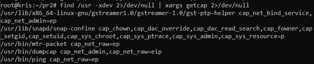
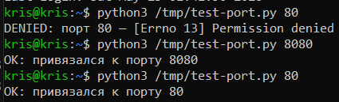
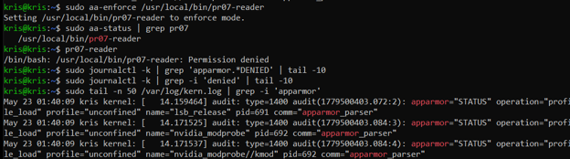
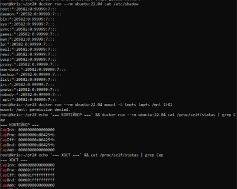
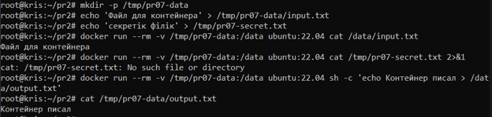
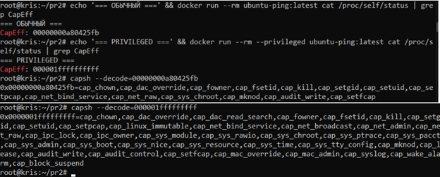
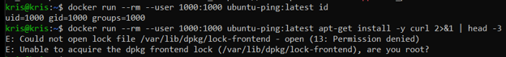
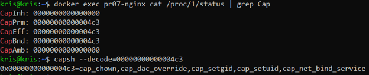

# ПР №7. AppArmor, Capabilities и Docker

## 1. Linux Capabilities

### Разбор getcap /usr/bin/ping
cap_net_raw=ep: cap_net_raw — — привилегия ядра Linux, позволяющая процессу использовать сырые сокеты (RAW/ICMP), что необходимо для сборки и отправки эхо-запросов утилиты `ping`, 
e — Effective (Эффективный флаг). Означает, что данная привилегия активируется автоматически сразу при запуске файла., 
p — Permitted (Разрешённый флаг). Задаёт максимальный набор прав, которые этот файл или процесс вообще имеет право использовать.



### CapPrm / CapEff / CapBnd — в чём разница

* **CapPrm (Permitted):** Набор разрешённых процессу привилегий. Это жесткий верхний предел возможностей. Процесс не может прыгнуть выше него или самостоятельно добавить себе флаг, которого здесь нет.
* **CapEff (Effective):** Набор эффективных привилегий, которые ядро проверяет в реальный момент времени при выполнении системного вызова. Процесс может временно включать и выключать биты из набора Permitted, перенося их сюда.
* **CapBnd (Bounding):** Ограничивающий набор. Он определяет максимальные права, которые процесс может сохранить при запуске другой программы через `execve` или передать дочерним веткам. Из него права можно только безвозвратно удалять.

### setcap — демонстрация
До: python3 порт 80 → [permission denied]
После setcap cap_net_bind_service=ep: → [привязался к порту]
**Почему лучше чем sudo:** `sudo` выдаёт процессу абсолютные права `root` (UID 0) над всей ОС — если в скрипте уязвимость, хост взломан. `setcap` выдаёт строго одно точечное разрешение (привязка к порту), оставляя процесс непривилегированным в остальном.



### Флаги e, i, p в cap_net_raw+eip

* **e (Effective):** Привилегия взводится в активное состояние сразу при запуске исполняемого файла.
* **i (Inheritable):** Разрешает наследовать данную capability дочерним процессам при вызове `execve` (работает в связке с наследуемым набором процесса).
* **p (Permitted):** Привилегия разрешена для использования и может быть программно активирована процессом в набор Effective.

## 2. AppArmor

### Количество профилей
enforce: 49, complain: 17

#### Что разрешено программе man согласно профилю?
На основании содержимого файла `/etc/apparmor.d/usr.bin.man` утилите `man` разрешены следующие действия:

* **Запуск связанных утилит форматирования и фильтрации текста:** Разрешен запуск таких программ, как `eqn`, `grap`, `pic`, `tbl`, `troff`, `vgrind`, `bzip2`, `gzip`, `xz` и др. Все они запускаются с переходом в отдельные специализированные субпрофили (`-> &man_groff` или `-> &man_filter`) для безопасной обработки недовсренных входных данных.
* **Глобальный доступ к файловой системе (с ограничениями DAC):** Строка `/** mrixwlk,` предоставляет программе права на чтение, запись, исполнение, блокировку и создание ссылок для файлов по всей системе (в рамках стандартных прав Linux), за исключением путей, явно заблокированных правилами мандатного контроля.
* **Использование сетевых сокетов:** Строка `unix,` разрешает использование UNIX-сокетов для межпроцессного взаимодействия (IPC).
* **Повышение/смена привилегий:** Строки `capability setuid,` и `capability setgid,` позволяют процессу менять свои UID/GID. Это необходимо для того, чтобы `man` мог корректно сбрасывать права root до прав обычного пользователя при обработке страниц или временно переключаться на системного пользователя (например, `man`) для работы с кэшем руководств.

#### Какой синтаксис используется в профиле?
В конфигурационном файле AppArmor применяется стандартный декларативный синтаксис мандатного доступа:

* `#include <...>` — директива включения внешних заголовочных файлов и базовых абстракций (например, базовых правил доступа к библиотекам `/include <abstractions/base>`).
* `/usr/bin/man { ... }` — объявление пути к исполняемому файлу, для которого описывается данный профиль (блок ограничений заключается в фигурные скобки).
* `**` — регулярное выражение (глобальный паттерн/wildcard), обозначающее любой файл или директорию на любую глубину вложенности.
* `mrixwlk` — комбинированная маска прав доступа:
  * `m` — memory map (разрешено отображение исполняемых файлов в память),
  * `r` — read (чтение),
  * `i` — inherit (наследование профиля),
  * `x` — execute (исполнение),
  * `w` — write (запись),
  * `l` — link (создание жестких ссылок),
  * `k` — lock (блокировка файлов).
* `-> &имя_профиля` — синтаксис направленного перехода (переключения контекста безопасности) в именованный субпрофиль при запуске дочерней утилиты.
* `capability <имя>` — ключевое слово для явного управления привилегиями Linux Capabilities POSIX.1e.

### Результаты pr07-reader
| Действие | Без профиля | complain | enforce |
|---|---|---|---|
| **Читать /tmp/pr07-allowed.txt** | Разрешено | Разрешено | Разрешено (если путь есть в белом списке профиля) |
| **Читать /etc/shadow** | Запрещено (защита ОС) | Запрещено стандартной ОС + лог нарушения AppArmor | Блокируется аппаратно AppArmor (`Permission denied`) |
| **Писать в /tmp/** | Разрешено | Разрешено | Разрешено (если явно выдан флаг `w`) |
| **Писать в /etc/** | Запрещено (нет прав) | Запрещено стандартной ОС + лог нарушения AppArmor | Блокируется аппаратно AppArmor (`Permission denied`) |

### Что AppArmor зафиксировал в логах?

В режиме `complain` подсистема AppArmor не блокировала действия скрипта, но зафиксировала два факта несанкционированного доступа (события со статусом **`ALLOWED`**), которые нарушали созданный профиль безопасности:
1.  **Попытку чтения защищённого системного файла:** Скрипт через утилиту `cat` запросил доступ к файлу `/etc/shadow`.
2.  **Попытку записи в системный каталог:** Скрипт попытался создать и записать данные в файл `/etc/pr07-hack.txt`.


### Разбор строки DENIED

* **operation="open"** — системный вызов, который пытался выполнить процесс (в данном случае скрипт пытался открыть файловый дескриптор для работы).
* **profile="/usr/local/bin/pr07-reader"** — имя конкретного мандатного профиля AppArmor, правила которого в данный момент принудительно применились к запущенной программе.
* **name="/etc/shadow"** — абсолютный путь к целевому защищаемому объекту (файлу), к которому процесс пытался получить доступ.
* **denied_mask="r"** — маска доступа, которая была принудительно заблокирована ядром Linux (`r` — чтение / read). Это означает, что AppArmor запретил процессу даже прочитать этот файл.

# вставить строку

```
audit(1779500403.084:5): apparmor="DENIED" operation="open" class="file" profile="/usr/local/bin/pr07-reader" name="/etc/shadow" pid=3386 comm="cat" requested_mask="r" denied_mask="r" fsuid=0



### Результаты работы скрипта pr07-reader под контролем AppArmor

| Действие скрипта | Без профиля | complain | enforce |
| :--- | :--- | :--- | :--- |
| **Читать /tmp/pr07-allowed.txt** | Разрешено | Разрешено | Разрешено |
| **Читать /etc/shadow** | Запрещено (базовая защита ОС) | Разрешено (с фиксацией в логах) | Блокируется (`Permission denied`) |
| **Писать в /tmp/pr07-output.txt** | Разрешено | Разрешено | Разрешено |
| **Писать в /etc/** | Запрещено (недостаточно прав Linux) | Запрещено (базовая защита ОС) | Блокируется (`Permission denied`) |


## 3. Docker — изоляция

| Ресурс | Хост | Контейнер |
|---|---|---|
| Количество процессов | >3000 шт | 1–2 шт (изолированы в PID namespace) |
| Сетевые интерфейсы | eth0, lo, docker0 | eth0, lo (изолированы в Net namespace) |
| Корневая файловая система | полная | изолированная (собственный слой ФС образа) |
| /etc/shadow хоста | доступен | недоступен (изолирован в Mount namespace) |

### Capabilities: обычный vs --privileged

* **Обычный CapEff:** `00000000000004c3` $\rightarrow$ `cap_chown`, `cap_dac_override`, `cap_setgid`, `cap_setuid`, `cap_net_bind_service`.
* **--privileged CapEff:** `0000001fffffffff` $\rightarrow$ Полный набор (абсолютно все capabilities Linux, включая `cap_sys_admin`, `cap_net_admin`, `cap_sys_rawio` и т.д.).

**Чего нет у обычного:** У обычного контейнера полностью вырезаны административные привилегии для управления ядром, сетью и оборудованием (например, `cap_sys_admin` — монтирование файловых систем, `cap_net_admin` — настройка фаервола и интерфейсов, `cap_sys_module` — загрузка модулей ядра).

**Почему --privileged опасен:** Этот флаг полностью отключает изоляцию Docker. Контейнер получает прямой доступ к устройствам хоста (`/dev/`), защищенным вызовам ядра и может легко выйти (совершить escape) из контейнера, полностью захватив контроль над основной хост-системой.



### Почему монтирование конкретной папки безопаснее чем --privileged?

Точечное монтирование каталогов позволяет предоставить приложению необходимый минимум данных для работы, полностью исключая риск несанкционированного доступа к критическим ресурсам операционной системы хоста.



### почему --privileged опасен? Каких capabilities нет у обычного контейнера?

Флаг `--privileged` **полностью отключает изоляцию** контейнера. Он предоставляет процессу внутри контейнера абсолютные root-права хоста, прямой доступ ко всем физическим устройствам (`/dev/`) и системным вызовам ядра. В случае компрометации (взлома) такого контейнера злоумышленник мгновенно совершает побег («container escape») на хост-машину и получает полный контроль над всем сервером

У обычного контейнера по умолчанию вырезаны все критические административные и системные привилегии. Согласно результатам декодирования маски `CapEff` (`00000000a80425fb`), у обычного контейнера **отсутствуют**:

* **`cap_sys_admin`** — главная административная привилегия (запрещает монтировать файловые системы, изменять параметры ядра и обходить мандатную защиту).
* **`cap_net_admin`** — блокирует возможность перенастраивать сеть хоста, менять таблицы маршрутизации и правила фаервола.
* **`cap_sys_module`** — запрещает динамическую загрузку и удаление модулей ядра Linux.
* **`cap_sys_rawio`** — перекрывает прямой доступ к физической памяти хоста и портам ввода-вывода оборудования.
* **`cap_sys_ptrace`** — запрещает отслеживать системные вызовы и внедрять сторонний код в чужие процессы на хосте.
* **`cap_sys_boot`** — блокирует выполнение команд на перезагрузку хост-машины изнутри изолированного окружения.



### почему запуск не от root важен для безопасности?

* **Блокировка побега из контейнера:** Если злоумышленник взломает приложение, он получит права обычной учетной записи (`uid=1000`). Имея низкие привилегии, он не сможет совершить побег («container escape») на хост-машину.
* **Принцип наименьших привилегий:** Сетевым сервисам для работы не нужен root. Запуск от обычного пользователя урезает лишние права «из коробки».
* **Защита целостности окружения:** Не-root пользователь физически не может изменять системные файлы, устанавливать сторонний софт через `apt` или ломать конфигурацию ОС.Монтирование конкретной папки (флаг `-v /tmp/pr07-data:/data`) является фундаментально более безопасным подходом, чем использование флага `--privileged`, по следующим ключевым причинам:



### Итоговый nginx

* **Capabilities:** `00000000000004c3` (`cap_chown`, `cap_dac_override`, `cap_setgid`, `cap_setuid`, `c>* **Почему именно эти:** `cap_net_bind_service` необходима для посадки веб-сервера на стандартный 80-й >



## 4. Эшелонированная защита

| Слой | Инструмент | Что ограничивает |
|---|---|---|
| **DAC** | `chmod` / `chown` | Дискреционный контроль доступа. Ограничивает права чтения, записи и выполнения файлов на уровне конкретных пользователей и групп Linux. |
| **Capabilities** | `--cap-drop ALL + cap-add` | Ограничивает системные вызовы к ядру Linux. Позволяет забрать у root-процесса в контейнере опасные административные привилегии, оставив только необходимый минимум. |
| **MAC** | AppArmor | Мандатный контроль доступа. Проверяет каждое действие процесса по жестким правилам (белым спискам), блокируя чтение/запись системных путей, даже если процесс запущен от root. |
| **Изоляция** | Docker namespaces | Пространства имен (PID, Net, Mount). Изолируют видимость ресурсов: контейнер не видит процессы хоста, его сетевые интерфейсы и основную файловую систему. |

## Выводы

В ходе лабораторной работы были изучены механизмы обеспечения безопасности и изоляции в Linux и Docker. На практике освоено создание и развертывание мандатных профилей AppArmor в режимах `complain` и `enforce`, что позволило защитить хост от деструктивных действий скриптов. Также был проведен анализ уязвимости контейнеров при избыточных привилегиях (`--privileged`) и настроен безопасный запуск веб-сервера с минимально необходимым набором системных Capabilities, что наглядно демонстрирует принцип построения эшелонированной защиты информационных систем.

### Контрольные вопросы

1. Чем DAC отличается от MAC? Почему одного DAC недостаточно?

2. Что означает запись `cap_net_bind_service=eip`? Чем `ep` отличается от `eip`?
* **Значение:** Запись даёт файлу право биндиться на порты < 1024 без запуска от root.
* **Флаги:** * `e` (Effective) — привилегия активна сразу при старте.
  * `i` (Inheritable) — привилегия наследуется дочерними процессами.
  * `p` (Permitted) — максимальный разрешенный набор для этого процесса.
* **Отличие `ep` от `eip`:** В режиме `ep` запущенная программа получит привилегию, но если она вызовет другую подпрограмму, та запустится уже без этой capability (так как нет флага `i` — наследования).

3. В чём разница между complain и enforce в AppArmor? Зачем нужен complain?
* **Разница:** В режиме **enforce** AppArmor жестко блокирует запрещенные действия и пишет логи. В режиме **complain** — только пишет предупреждения в логи, но ничего не блокирует.
* **Зачем нужен complain:** Используется при тестировании. Позволяет запустить приложение, собрать информацию обо всех его системных запросах и настроить профиль без риска сломать работу сервиса.

4. Docker использует то же ядро, что и хост — почему тогда контейнер изолирован?
Изоляция достигается за счёт встроенных механизмов ядра Linux:
* **Namespaces (пространства имён):** Разделяют видимость ресурсов (PID прячет процессы хоста, Net — сетевые интерфейсы, Mount — файловую систему).
* **Cgroups (контрольные группы):** Ограничивают потребление физических ресурсов (CPU, RAM).

5. Злоумышленник нашёл RCE в nginx (контейнер без --privileged, с --cap-drop ALL --cap-add NET_BIND_SERVICE, не-root, AppArmor). Что он может и не может сделать?
* **Может:** Нарушить логику работы самого веб-сервера, прочитать/изменить файлы внутри папки `www` или логи сервера, к которым у пользователя `nginx` есть доступ по DAC.
* **Не может:** Совершить побег на хост, получить доступ к процессам хоста, изменить сетевые настройки карты, прочитать `/etc/shadow` хоста или установить софт через `apt` (все эти действия наглухо заблокированы AppArmor, отсутствием Capabilities и правами не-root).

6. Почему --privileged — антипаттерн? Когда всё же оправдан?
* **Почему антипаттерн:** Он полностью уничтожает смысл изоляции Docker, возвращая контейнеру все Capabilities и прямой доступ к устройствам хоста. Взлом такого контейнера равен взлому всего сервера.
* **Когда оправдан:** Только в специфических системных задачах: когда сам Docker запускается внутри Docker (DinD), при развёртывании систем оркестрации (Kubernetes), либо для утилит глубокого мониторинга железа и запуска виртуализации на хосте.
