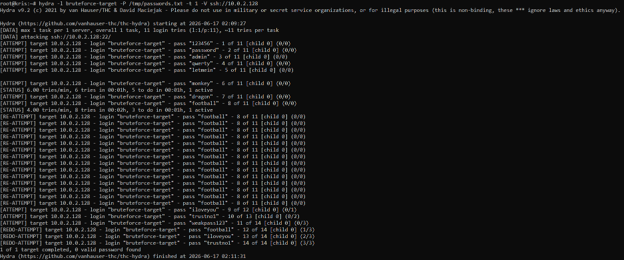
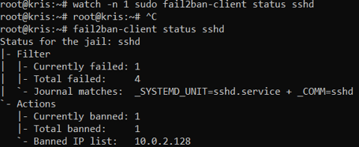
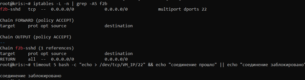
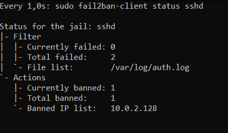
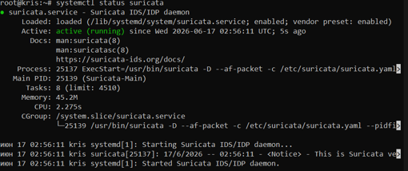
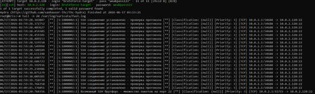

# ПР №10. Обнаружение вторжений: fail2ban и Suricata

## 1. Настройка fail2ban

Параметры jail (до усиления): maxretry=3, findtime=600, bantime=600
Какие параметры показывает статус тюрьмы перед началом атаки?
- Actions (количество забаненных на текущий момент и всего: Currently banned, Total banned, а также список Banned IP list).
- Filter (количество неудачных попыток: Currently failed, Total failed).
Регулярное выражение фильтра sshd:
 `^%(__prefix_line)sFailed (?:password|publickey) for .* from <HOST>(?: port \d+)?(?: ssh\d*)?$`

## 2. Брутфорс через hydra

Сколько неудачных попыток до бана: 3 (maxretry=3)
Забаненный IP: 10.0.2.128
Время от начала атаки до бана: ~3 секунды

## 3. Механизм блокировки

Через что физически блокируется IP: iptables (цепочка f2b-sshd)

## 4. Усиленная защита

Новые параметры: maxretry=2, findtime=300, bantime=1800, factor=2
Разница во времени срабатывания бана: бан наступил на 1-2 секунды раньше (после 2 попыток вместо 3)
Что означает bantime.increment: прогрессивное увеличение времени бана при повторных нарушениях (первый бан — 30 мин, второй — 1 час, третий — 2 часа и т.д.)

Запустилась ли служба без ошибок? да, служба запустилась абсолютно без ошибок.

## 5. Suricata

Своё правило (sid 1000001): 
- alert tcp any any -> $HOME_NET 22 (msg:"Возможный SSH брутфорс - множество пакетов на порт 22"; flow:to_server; threshold:type both, track by_src, count 10, seconds 10; sid:1000001; rev:2;)

Дополнительные поля в eve.json по сравнению с fast.log: flow_id (идентификатор сессии), in_iface (интерфейс), статистика flow (pkts_toserver, bytes_toclient), alert.severity (критичность), src_ip/dest_ip (отдельно от сообщения)

## 6. Сравнение fail2ban vs Suricata

| Вопрос | fail2ban | Suricata |
|--------|----------|----------|
| На каком этапе заметил атаку (после скольких попыток) | После 3 неудачных попыток (реактивно) | После 10 SYN-пакетов за 10 секунд (проактивно) |
| Что конкретно увидел в логе | Запись "Failed password" из sshd.log | Алерт "Возможный SSH брутфорс - множество пакетов на порт 22" |
| Заблокировал ли атаку автоматически | Да (iptables REJECT) | Нет (только алерт, т.к. режим IDS, не IPS) |
| Какую информацию дал о происходящем | Только факт бана и IP нарушителя | Подробную JSON-метрику: количество пакетов, байт, интерфейс, сессию |

## 7. Связь с нормативкой

| Группа мер ФСТЭК | Как реализована в работе |
|-------------------|---------------------------|
| АУД (регистрация событий) | Логи fail2ban (/var/log/fail2ban.log) и Suricata (fast.log, eve.json) фиксируют попытки подбора паролей |
| УПД (управление доступом) | fail2ban блокирует IP через iptables, ограничивая доступ нарушителю |
| ЗИС (защита от несанкционированного доступа) | Обнаружение брутфорса на сетевом уровне (Suricata) и прикладном (fail2ban) |

## Выводы

В ходе работы настроены две системы обнаружения вторжений: fail2ban (логический IDS/IPS) и Suricata (сетевой IDS). На практике подтверждено, что fail2ban эффективно блокирует SSH-брутфорс на уровне файрвола после 3 неудачных попыток. Усиление параметров (maxretry=2, bantime.increment) сократило время реакции. Suricata успешно обнаружила атаку по сигнатуре на сетевом уровне и предоставила детальную JSON-телеметрию. Выявлено ключевое отличие: fail2ban — реактивный IPS с блокировкой, Suricata — проактивный IDS с детальным анализом, но без автоматической блокировки по умолчанию.

## Контрольные вопросы (сокращённо)

1. **Чем IDS отличается от IPS? Можно ли назвать fail2ban IPS?**
   - IDS — обнаруживает и уведомляет. IPS — обнаруживает и блокирует автоматически. fail2ban можно назвать IPS, т.к. он блокирует IP через iptables. Формально его относят к HIDS, но по функционалу он IPS.

2. **Почему атака на 127.0.0.1 не сработает?**
   - В ignoreip по умолчанию прописан 127.0.0.1/8. Чтобы сработало, нужно атаковать реальный IP (VM_IP) либо удалить 127.0.0.1 из ignoreip.

3. **Что будет при maxretry=1000, findtime=1?**
   - Защита будет неэффективной: злоумышленник сможет сделать 999 попыток за 1 секунду, что физически невозможно, но если успеет — бан не наступит до 1000-й попытки.

4. **Сигнатурное vs аномальное обнаружение. Какое у вашего правила?**
   - Сигнатурное — правило ищет чёткий паттерн (SYN-пакеты на порт 22 с порогом count). Аномальное выявляет отклонения от поведения, сигнатурное — по известным шаблонам атак.

5. **Прав ли сисадмин, что Suricata делает брутфорс невозможным?**
   - Нет. Suricata по умолчанию в режиме alert (IDS), а не block (IPS). Она только уведомляет, но не блокирует трафик. Без дополнительной настройки (inline/NFQUEUE) брутфорс продолжается.

6. **Что означает threshold: type both, track by_src, count 5, seconds 60?**
   - Генерировать алерт не чаще 1 раза при условии: от одного источника (by_src) поступило 5 совпадающих событий за 60 секунд. "Both" = алерт выдаётся только при достижении порога, а не на каждый пакет.

7. **Зачем bantime.increment против настойчивых атакующих?**
   - Чтобы увеличивать время бана с каждым повторным нарушением (прогрессивно: 30 мин → 1 ч → 2 ч ...). Это делает повторные атаки экономически невыгодными и отсеивает настойчивых нарушителей.
